## Quantification of thrip damage patterns to leafs

This project analyzes multi-channel leaf images to quantify thrip feeding damage patterns. The pipeline detects leaf and damage masks, computes spatial metrics (including island counts/distances, radial distributions, autocorrelation, roundness, and total damage area in pixels and optional cm²), and exports both summary tables and diagnostic plots for synthetic and real datasets.

## To install

To find out how to get started with Python and related required software to 
conveniently run scripts, please check out our [blog post](https://www.biodsc.nl/posts/installing_conda_python.html) about this.

Assuming you already have Conda installed and your preferred environment set up, install the following libraries to be able to run the scripts in this repository:

```bash

conda install -c conda-forge numpy pandas scipy scikit-image matplotlib seaborn pillow opencv openpyxl -y
```


## To run

To run this script, check out the files:
- `leafstats_project_example_1channel.py`, which shows how to analyze a dataset where 1 channel was recorded to identify the leaf and the damage done by thrips.
- `leafstats_projects_example_3channels.py`, which shows how to analyze a dataset where 3 channels were taken, 1 for identifying the leaf, and 1 for quantifying the damage.

## Considerations of the analysis

This script:
- segments the leaves in a straighforward way
- quantifies leave damage in a straightforward way
- tries to quantify potential feeding patterns

The main analysis script is `leafstats_analysis.py`. In the examples referenced
above, this script is imported as follows:

```{python}
import leafstats_analysis as lsa
```

You can now call functions from `leafstats_analysis.py` for example like
`lsa.run_complete_analysis()`.

### Segmentation of leaves

Segmentation of the leave is based on standard threshold algorithms.

Segmentation is performed by the function `lsa.get_largest_mask()`, which is 
called automatically by the function `lsa.run_complete_analysis()`.

This function determines a threshold based on either:

- 10x the background level
- Otsu method
- Triangle method

When a seperate channel was used to record the leaf, the default `bg10` method
works well. 
When a single channel was used to record both damage and the leaf outline
in one go, the `triangle` method is more suitable.

#### More details

To prevent background artifacts to be taken along, the largest consecutive
area that is above the threshold is selected and assumed to be the leaf.

Additional tuning parameters are:

- `leaf_roundness_threshold`, default: 0
    - Roundness is defined as $R = 4 \pi A / C^2$. With A the area, and C
    the circumference. For a perfect circle, $4 \pi A = C^2$, and $R =1$. The 
    lower the value, the least an object looks like a circle.
    - This can be used to disregard suggestd leaf segmentation masks
    that are not round (and thus likely not proper masks). A cutoff of e.g. 
    0.8 will select leaves that are approximately round.
- `apply_smooth_leafmask`, default: False
    - Will apply morphological operation (opening) to make the edge 
    of the mask more smooth.
    
### Determining the damaged area

Which area is considered "damaged" in the end depends on an arbitrary
threshold.

The choice of threshold will affect all further statistics that try
to describe the damage pattern.

This threshold is determined automatically. For many threshold algorithms,
the threshold level will depend both on the pattern of low signal (undamaged)
as well as the pattern of high signal (damaged), and inbetween values.

This needs to be avoided, as we don't want the amount of damage influencing
how the damage pattern is quantified.

The algorithm chosen here attempts to set a threshold value independent
of the amount of damage present. It focuses on determining the damage intensity 
background signal, which is done by using the mode of the damage channel. 
Everything with an intensity higher than 2x the mode (or background signal)
is considered "damaged".

**A critical assumption here is that there should be a substiantal background 
area present.**

The image below shows the result of both segmentation of the leaf
and determining the damaged area:

<!-- img "Example_data/DATA/condition_Control/Example_A_1.tif" -->

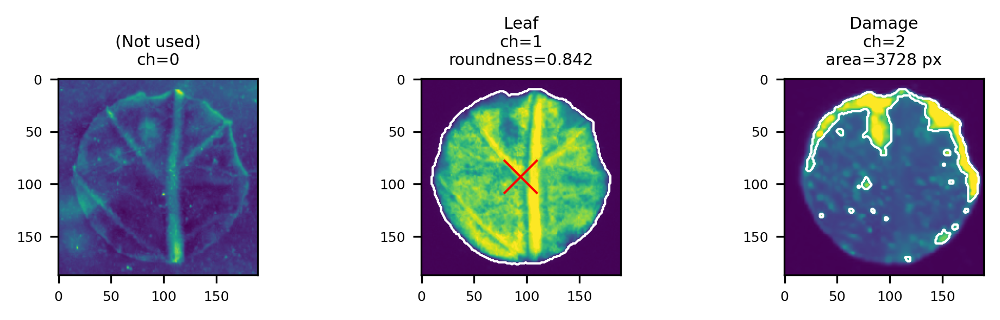

White lines indicate the outline of the segmented areas.

## Quantifying damage patterns

To assess the nature of the damage patterns, multiple metrics are calculated.

To understand what these metrics can do, a synthetic dataset was used:

This dataset contained the following "leafs" with corresponding "damage
patterns":

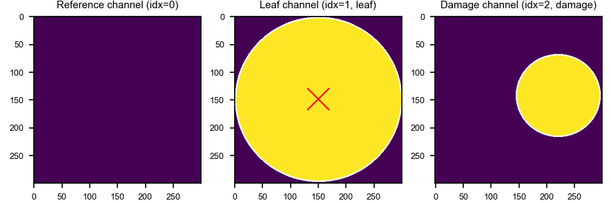
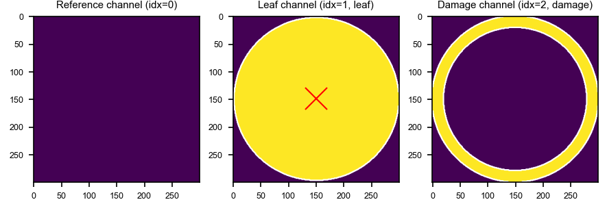
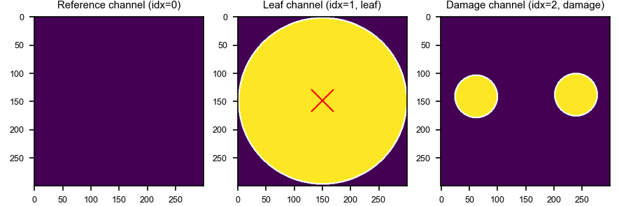
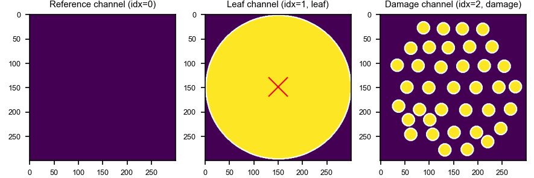

### Functions to quantify the damage pattern

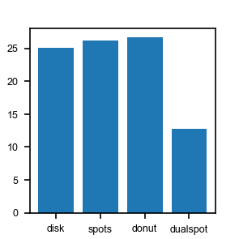

(set ±equal)

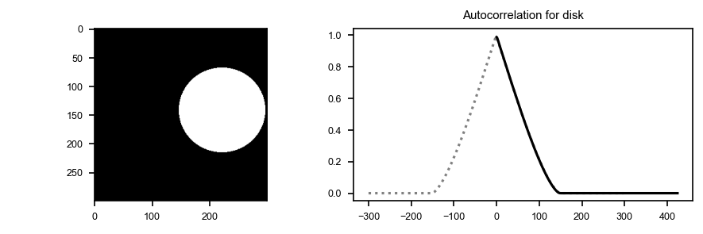
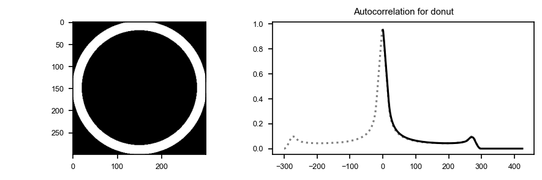
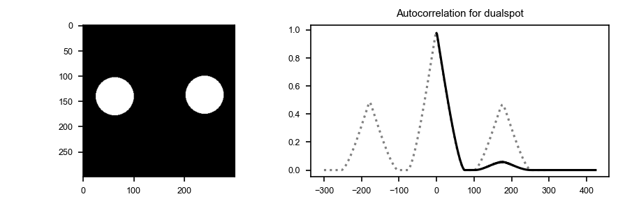
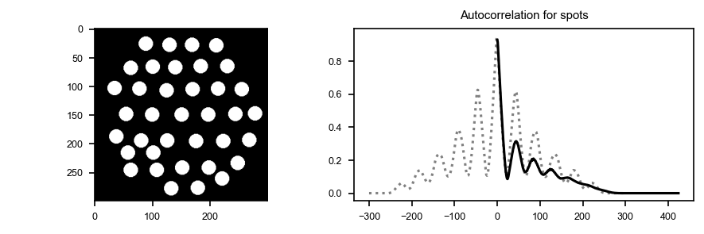


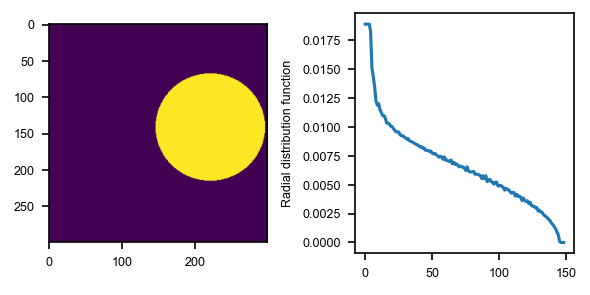
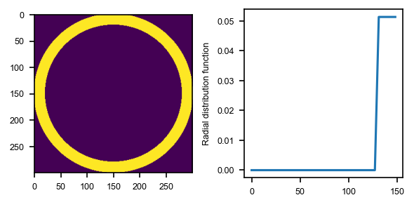
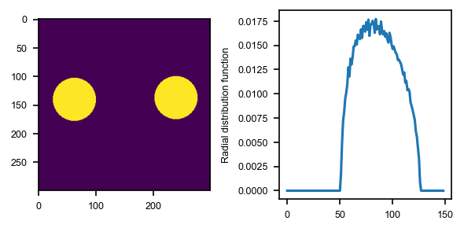
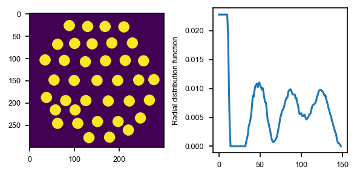


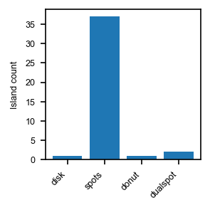
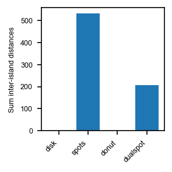


## Notes on running the script

#### Set up file structure and configuration

Before running the actual analysis, information is constructed about which files to use
and what configuration these files are.

This is based on choosing different directories with images 
that each correspond to a specific condition. This can be set as follows:
```{python}
# 1) Tell script where data is and which channels should be used
# Conditions and paths to images for that condition
condition_path_map = {
    'Ctrl': '/Users/m.wehrens/Data_UVA/2024_small-analyses/2025_Nina_LeafDamage/20260529_Exampledata/DATA/condition_Control',
    'Edited': '/Users/m.wehrens/Data_UVA/2024_small-analyses/2025_Nina_LeafDamage/20260529_Exampledata/DATA/condition_Photoshopped'
}
```
Note that a so-called `dict` is used to link each condition (e.g. `'Ctrl'`)
to a specific folder.

Additionally, the script needs to know in which channel to look for the
leaf data and where to look for the damage. A third channel can be displayed
and is called the reference channel.
```{python}
# Channel configuration
leaf_channel_spec = {'channel': 1, 'name': 'Leaf'}
damage_channel_spec = {'channel': 2, 'name': 'Damage'}
reference_channel_spec = {'channel': 0, 'name': '(Not used)'} # can be set to None
```
Again a `dict` is used. For each channel, the `'channel'` entry 
conveys which channel to use (e.g. `0`, the first channel), and the
`name` entry conveys the name of that channel.

A list of files is then collected by calling the following function:
```{python}
# obtain 
data_file_paths = lsa.get_data_file_paths(condition_path_map)
```

#### Running the analysis

The code 

```{python}
data_all = lsa.run_complete_analysis(
    data_file_paths = data_file_paths, 
    leaf_channel_spec = leaf_channel_spec, 
    damage_channel_spec = damage_channel_spec,   
    # optional parameters 
    leaf_threshold_method = 'bg10',
    leaf_roundness_threshold=0,
    apply_smooth_leafmask=False,
    pixel_to_cm2_factor=pixel_to_cm2_factor
)
```

will run all analyses, and collect data in the `data_all` parameter.

See above for how to set the optional parameters.

When `pixel_to_cm2_factor` is set, areas in pixels will be multiplied
with this factor to determine the area in square centimeters.

#### Generating plots

To generate each of the plots, the following functions can be used:

```{python}
lsa.plot_acf_norms_avgrs(data_all, OUTPUTDIR)
```

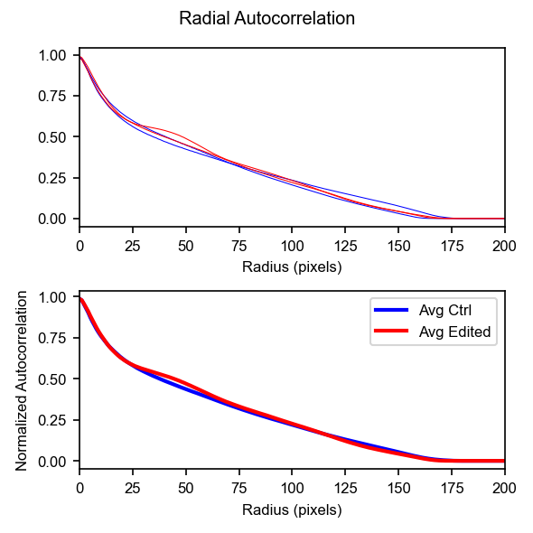

```{python}
lsa.plot_interisland_distances(data_all, OUTPUTDIR, remove_zerocnt=False)
lsa.plot_interisland_distances(data_all, OUTPUTDIR, remove_zerocnt=True)
```

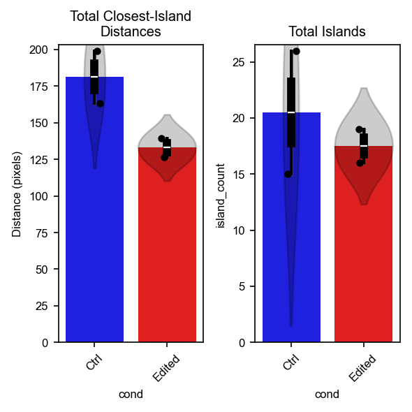

```{python}
lsa.plot_radial_pdfs(data_all, OUTPUTDIR)
```
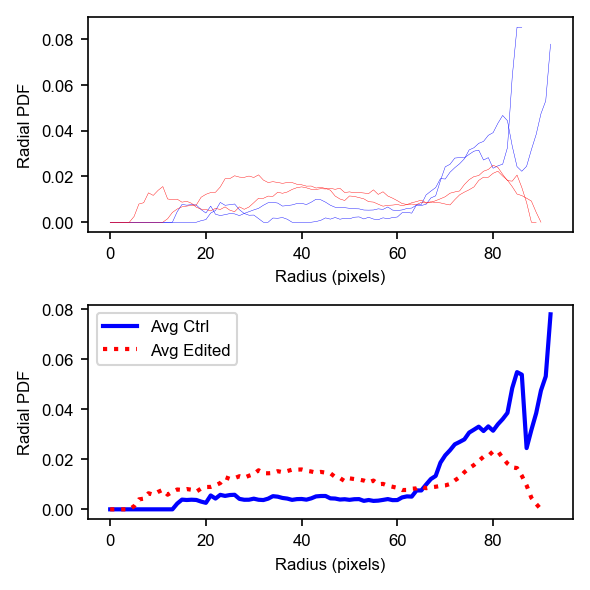

```{python}
lsa.plot_damaged_area(data_all, OUTPUTDIR)
```
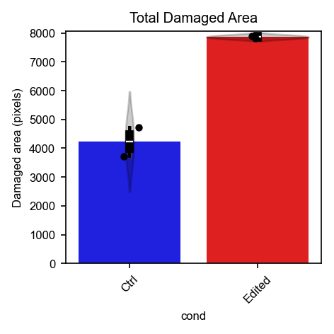


Set `OUTPUTDIR` to a directory where you want the plots to be exported.

To inspect single segmentation and damage area segmentation, run the following function:

```{python}
# 4) Export per-image mask overlays to output folders
lsa.run_plot_and_save(
    data_all,
    data_file_paths,
    OUTPUTDIR,
    leaf_channel_spec,
    damage_channel_spec,
    reference_channel_spec
)
```


#### Exporting data to excel/csv

Finally, the following lines export data to csv and excel files.

```{python}
df_singledata = lsa.export_singledatapoints(
    data_all,
    data_file_paths
)
df_singledata.to_csv(OUTPUTDIR + '/leaf_damage_singlemetrics.csv', index=False)
df_singledata.to_excel(OUTPUTDIR + '/leaf_damage_singlemetrics.xlsx', index=False)
```

The function `lsa.export_singledatapoints` collects all data in a 
pandas dataframe (`df_singledata` in the example above). 

## Technical notes

The code can still be improved from a software engineering perspective, 
and could also be further improved regarding readability (e.g. function
names and comments). 


