## Quantification of thrip damage patterns to leafs

This project analyzes multi-channel leaf images to quantify thrip feeding damage patterns. The pipeline detects leaf and damage masks, computes spatial metrics (including island counts/distances, radial distributions, autocorrelation, roundness, and total damage area in pixels and optional cm²), and exports both summary tables and diagnostic plots for synthetic and real datasets.

## To install

To find out how to get started with Python and related required software to 
conveniently run scripts, please check out our [blog post](https://www.biodsc.nl/posts/installing_conda_python.html) about this.

Assuming you already have Conda installed and your preferred environment set up, install the following libraries to be able to run the scripts in this repository:

```bash

conda install -c conda-forge numpy pandas scipy scikit-image matplotlib seaborn imageio openpyxl -y
```

## To run

To run this script, check out the files:
- [leafstats_example_1channel.py](leafstats_example_1channel.py), which shows how to analyze a dataset where 1 channel was recorded to identify both the leaf and the damage done by thrips. (In the example, the same channel of the example images is simply assigned to both roles, for illustratory purposes.)
- [leafstats_example_3channels.py](leafstats_example_3channels.py), which shows how to analyze a dataset where 3 channels were taken, 1 for identifying the leaf, 1 for quantifying the damage, and 1 that is only displayed for reference.
- [leafstats_syntheticdata.py](leafstats_syntheticdata.py), which runs the analysis on the synthetic images in [Synthetic_data/](Synthetic_data/); it generates the synthetic-data figures shown below, and additionally runs the regular analysis pipeline on those same images.

The first two examples run out of the box on the images in [Example_data/](Example_data/).
All three scripts refer to those images with paths relative to the root of this repository,
so **run them with the repository root as your working directory**. 
Paths may also be given as absolute paths, which is convenient when your own 
data is located elsewhere.

## Expected input

A `.tif` image files where 

- 1 channel recorded intensity of the leaf itself (to be able to segment the leaf)
- 1 channel recorded the thrip activity pattern (using near infrared, NIR, sometimes colloqually referred to as "damage" in this repo)

Ideally, these channels are separate to avoid artifacts and detect
leaves properly, but the damage channel can also be used
to segment the leaf, in which case a single-channel image can be provided as 
input aswell.

<br>
***Example input image.** The green channel corresponds to the leaf intensity, 
and the blue channel to the thrip activity (NIR). The red channel does not 
enter any of the metrics; it can be assigned as the "reference" channel, in 
which case it is only displayed alongside the other two.*

| Red channel | Green channel | Blue Channel |
| ------- | ------- | ------- |
|  |  |  |

***Example input image.** Same as above, but the R, G, B channels
are displayed separately here in gray scale.
The green channel corresponds to the leaf intensity, 
and the blue channel to the thrip activity (NIR). 
The red channel does not enter any of the metrics, and is only displayed 
when it is assigned as the "reference" channel.*

## Considerations of the analysis

This script:
- segments the leaves in a straighforward way
- segments and quantifies leaf damage in a straightforward way
- tries to quantify potential feeding patterns

The main analysis script is [leafstats_analysis.py](leafstats_analysis.py). In the examples referenced
above, this script is imported as follows:

```{python}
import leafstats_analysis as lsa
```

When you run this line, you can call functions from [leafstats_analysis.py](leafstats_analysis.py) using e.g.
`lsa.run_complete_analysis()`.

### Segmentation of leaves

Segmentation of the leaf is based on standard threshold algorithms.

Segmentation is performed by the function `lsa.get_largest_mask()`, which is 
called automatically by the function `lsa.run_complete_analysis()`.

This function determines a threshold based on either:

- 10x the background level (`leaf_threshold_method='bg10'`)
- Otsu method (`leaf_threshold_method='otsu'`)
- Triangle method (`leaf_threshold_method='triangle'`)

When a seperate channel was used to record the leaf, the default `bg10` method
works well. 
When a single channel was used to record both damage and the leaf outline
in one go, the `triangle` method is more suitable.

#### More details

To prevent background artifacts to be taken along, the largest consecutive
area that is above the threshold is selected and assumed to be the leaf.

Additional tuning parameters are:

- `leaf_roundness_threshold`, default: 0
    - Roundness is defined as $R = 4 \pi A / C^2$. With A the area, and C
    the circumference. For a perfect circle, $4 \pi A = C^2$, and $R =1$. The 
    lower the value, the least an object looks like a circle.
    - This can be used to disregard suggested leaf segmentation masks
    that are not round (and thus likely not proper masks). A cutoff of e.g. 
    0.8 will select leaves that are approximately round.
- `apply_smooth_leafmask`, default: False
    - Will apply morphological operation (opening, with a disk of radius 
    10 pixels) to make the edge of the mask more smooth.
    
### Determining the damaged area

Which area is considered "damaged" in the end depends on the selected
threshold.

The choice of threshold will affect all further statistics that try
to describe the damage pattern.

This threshold is determined automatically. For many threshold algorithms,
the threshold level will depend both on the pattern of low signal (undamaged)
as well as the pattern of high signal (damaged), and inbetween values.

This needs to be avoided, as we don't want the amount of true damage influencing
the detection of the damaged region and the detected damage pattern.

**Above twice background is damage.** The algorithm chosen here attempts 
to set a threshold value independent
of the amount of damage present. It focuses on determining the damage intensity 
background signal, which is done by using the mode of the damage channel
(within the leaf mask). 
Everything with an intensity higher than 2x the mode (or background signal)
is considered "damaged".

There are some critical assumptions here:

- **Critical assumption 1:** There should be a substiantal background 
area present.
- **Critical assumption 2:** The background intensity scales with the damage 
intensity. (Or alternatively all images should be taken under equal illumination and 
acquisition conditions.)

The image below shows the result of both segmentation of the leaf
and determining the damaged area:

<!-- img "Example_data/DATA/condition_Control/Example_A_1.tif" -->

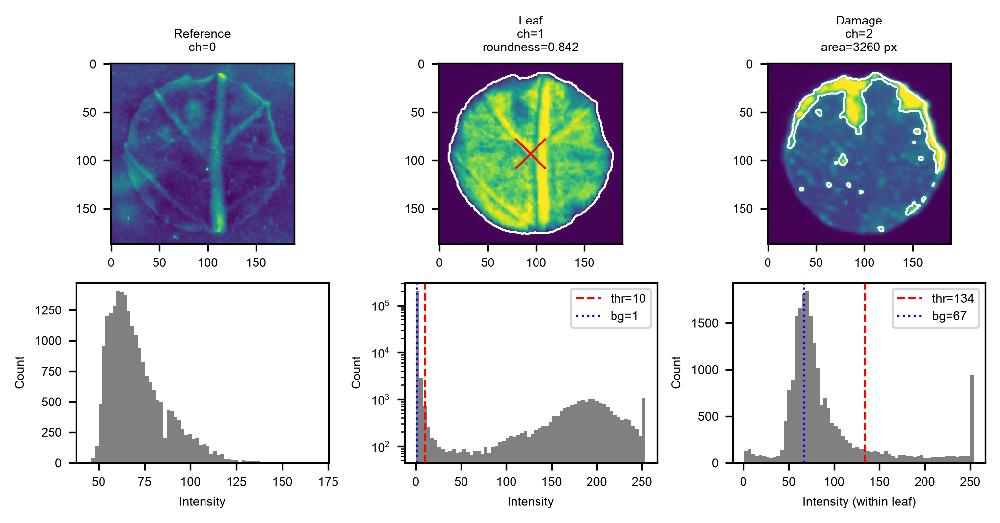

***Figure.** White lines indicate the outline of the segmented areas. Histograms of 
pixel intensities are shown below the images. For "leaf" and "damage",
the blue line indicates the extrapolated background intensity, and 
the red line the threshold that was used for the mask.*

##### Testing the critical assumptions

If you took all images under similar acquisition settings and conditions, 
the background damage (NIR) levels should be equal over all conditions.
To assess this, you can check out the plot with the background damage levels
(`background_dmg`, see also below);


There should not be trends in this plot, unless you can explain the trend
and know this won't violate above assumptions.

##### Potential improvements

The distribution of undamaged leaf intensity could be estimated in more
sophisticated ways (e.g. fitting a gaussian to part of the histogram),
allowing for a better estimate on what the expected range of 
undamaged signal is, and thus what can be considered damaged area.

## Quantifying damage patterns

To assess the nature of the damage patterns, multiple metrics are calculated.

To get a feeling for what these metrics can do, a synthetic dataset was used; 
this dataset contained the following "leafs" with corresponding "damage patterns":

- "Disk" damage pattern:

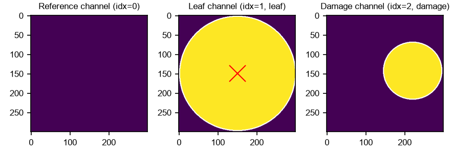

- "Donut" damage pattern:

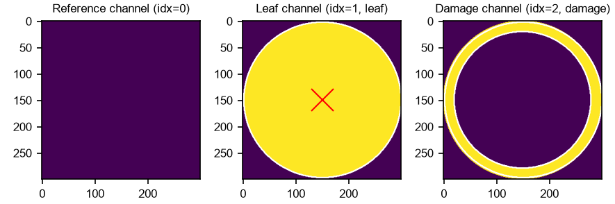

- "Dual spot" damage pattern:
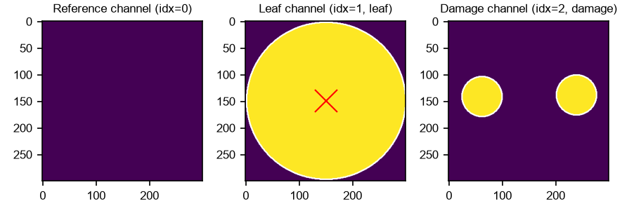

- "Spots" damage pattern:

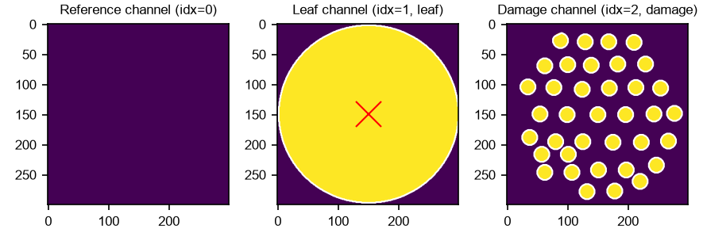

### Metrics to quantify the damage pattern

#### Amount of damage

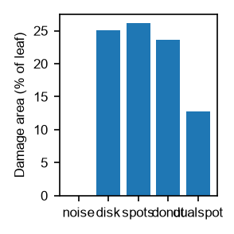

(This was chosen to be ±equal, except for "dual spot".)

#### Autocorrelation function (ACF)

Average correlation between the damage signal in two pixels that are a distance X apart.

Concretely, if the correlation is positive at distance X, 
it means that the intensity for any two pixels with distance X is likely
to be more similar.
If the correlation is negative at distance X, it's likely the signal
for two pixels at distance X is opposite between the two pixels.

The 
distance at which the curve first crosses zero thus reflects the size of the 
damaged features, whereas a secondary peak reflects a typical spacing between 
them. 

For our examples the ACF is shown in the plots below.
Here, the thick black line is the
radially integrated ACF, ie ACF(X). 
The grey dotted line can be ignored (it is a technical check, 
the horizontal center line of the 2d ACF, i.e.
$`ACF(x, \frac{L_y}{2})`$).


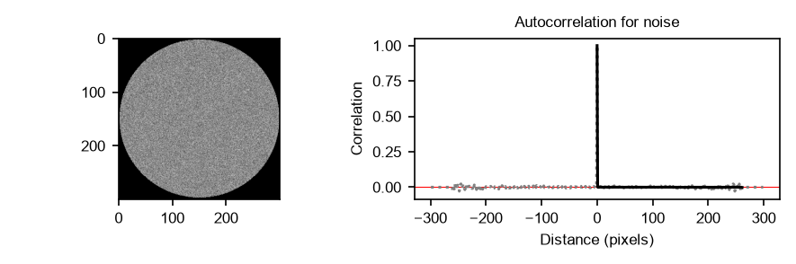
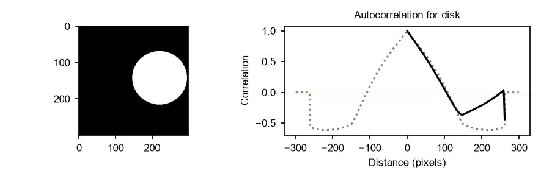
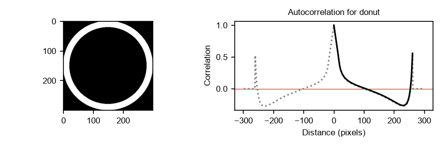
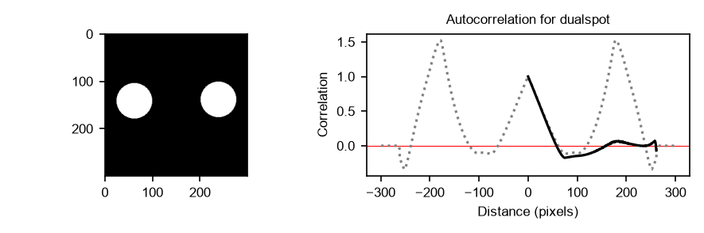
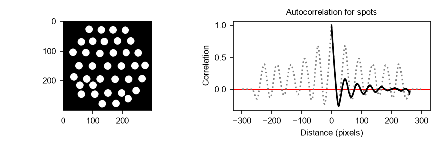

**Technical note 1:** Note that the curve is normalized by the variance over the whole leaf, so 
such a secondary peak can exceed 1 (see "dual spot").

**Technical note 2:** We define the ACF for a displacement vector $`\vec{X}`$ as

```math
\mathrm{ACF}(\vec{X}) = \frac{1}{\sigma^2\, n(\vec{X})}
    \sum_{\vec{x} \in M,\ \vec{x}+\vec{X} \in M}
    \left(I(\vec{x})-\mu\right)\left(I(\vec{x}+\vec{X})-\mu\right)
```

with $`I`$ the damage channel, $`M`$ the leaf mask holding $`N`$ pixels,
$`\mu`$ and $`\sigma^2`$ the mean and variance of $`I`$ within $`M`$, and
$`n(\vec{X})`$ the number of pixel pairs separated by $`\vec{X}`$ that have
both pixels inside $`M`$. Dividing by $`n(\vec{X})`$ normalizes by the 
number of pairs considered.
Displacements with too few contributing pairs ($`n(\vec{X}) < fN`$, with
$`f=0.05`$ as default value) are considered unreliable and discarded.
$`\mathrm{ACF}(d)`$ is then the average of $`\mathrm{ACF}(\vec{X})`$ over all
retained $`\vec{X}`$ of length $`\lfloor|\vec{X}|\rfloor = d`$.
See also [notes/ACF.md](notes/ACF.md).


#### Radial distribution

Average signal from the center of the leaf at distance X.

The aim of this function is to characterize whether the location on the leaf
(in terms of distance from the center) affects the likelyhood of damage.

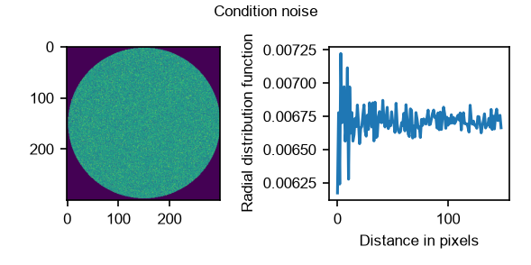
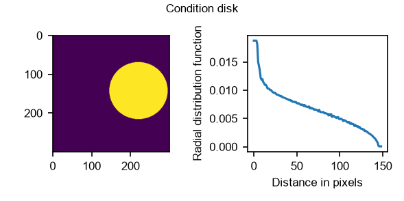
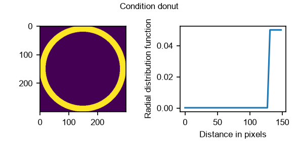
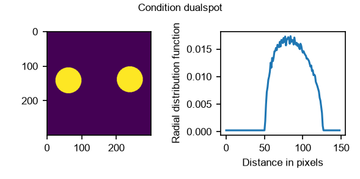
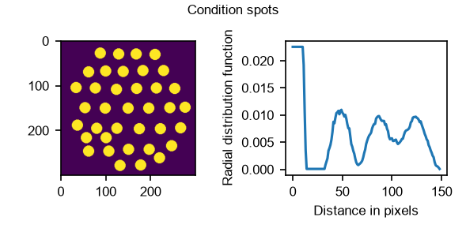

#### Island statistics

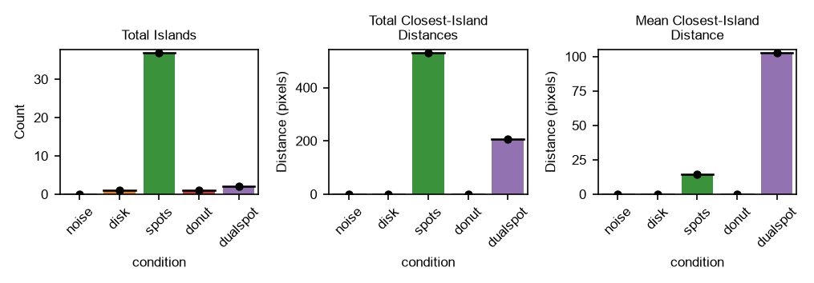

##### Island count

The number of separate continuous regions of damage (the number of connected components),
also referred to as *islands*, that are observed in the damage mask.
This assesses the spatial features of the feeding behavior.

##### Total nearest-island distance

To further investigate spatial features of feeding behavior, 
we look at the sum of nearest-island distances $D$.

Mathematically, this is defined as 


```math
D = \sum_{n} \min_{m \neq n} d_{nm}
```

which is the sum over the smallest edge-to-edge distance $d$ between island n and all other
islands m (with $m \neq n$ excluding self-distance).

Additionally, we look at the average nearest-island distance, $`\bar{D} = D / N`$, 
with $`N`$ the number of islands. 

Note that when fewer than two islands are detected, there is no distance to
another island; both $`D`$ and $`\bar{D}`$ are reported as 0 in that case.

## Notes on running the script

#### Set up file structure and configuration

Before running the actual analysis, information is constructed about which files to use
and what configuration these files are.

This is based on choosing different directories with images 
that each correspond to a specific condition. This can be set as follows:
```{python}
# 1) Tell script where data is and which channels should be used
# Conditions and paths to images for that condition
condition_path_map = {
    'Ctrl': 'Example_data/DATA/condition_Control',
    'Edited': 'Example_data/DATA/condition_Photoshopped'
}
```
Note that a so-called `dict` is used to link each condition (e.g. `'Ctrl'`)
to a specific folder.

These folder paths can be absolute, or relative to your working directory,
as in the example above. The same holds for `OUTPUTDIR`.
The condition names are also used to organize the exported per-image plots,
which end up in `OUTPUTDIR/plots/segmentation_masks/<condition>/`.

Additionally, the script needs to know in which channel to look for the
leaf data and where to look for the damage. A third channel can be displayed
and is called the reference channel.
```{python}
# Channel configuration (channel index per role; Reference can be None)
config_channels = {
    'Leaf': 1,
    'Damage': 2,
    'Reference': 0 # optional
}
```
Again a `dict` is used. Each entry links a role (`'Leaf'`, `'Damage'` or
`'Reference'`) to the index of the channel that should be used for that role
(e.g. `0`, the first channel). The reference channel is only displayed in the
per-image plots, and can be set to `None` when it isn't needed. To analyze a
single-channel dataset, simply point both `'Leaf'` and `'Damage'` to the same
channel (see [leafstats_example_1channel.py](leafstats_example_1channel.py)).

A list of files is then collected by calling the following function:
```{python}
# obtain 
data_file_paths = lsa.get_data_file_paths(condition_path_map)
```

#### Running the analysis

The code 

```{python}
df_samples, array_data = lsa.run_complete_analysis(
    data_file_paths = data_file_paths, 
    config_channels = config_channels,   
    # optional parameters 
    leaf_threshold_method = 'bg10',
    leaf_roundness_threshold=0,
    apply_smooth_leafmask=False,
    pixel_to_cm2_factor=pixel_to_cm2_factor
)
```

will run all analyses, and returns the results in two objects:

- `df_samples`, a pandas dataframe with one row per image, holding all
single-value metrics (e.g. `island_counts`, `total_damage_area_px`,
`total_damage_percentage`, `threshold_val_dmg`, `background_dmg`), plus the
condition, the file path, and status fields (`leaf_found`, `damage_found`,
`analysis_status`) that record whether the analysis succeeded for that image.
- `array_data`, a `dict` keyed by file path, holding the array-like results
per image (the images themselves, the leaf and damage masks, the centroid, the
autocorrelation, and the radial distribution).

Both are needed for the plotting functions below.

See above for how to set the optional parameters.

When `pixel_to_cm2_factor` is set, areas in pixels will be multiplied
with this factor to determine the area in square centimeters.

#### Generating plots

To generate each of the plots, the following functions can be used:

```{python}
lsa.plot_acf_norms_avgrs(df_samples, array_data, OUTPUTDIR)
```

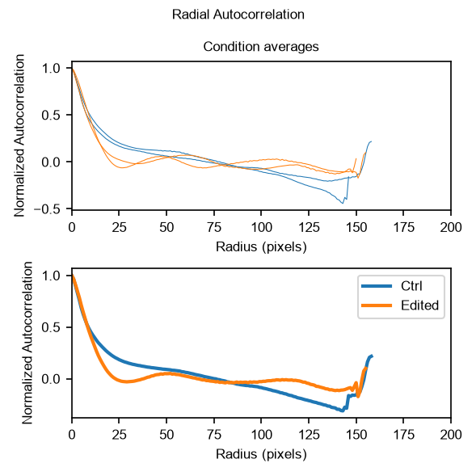

```{python}
lsa.plot_nearest_island_distances(df_samples, OUTPUTDIR, remove_zerocnt=False)
lsa.plot_nearest_island_distances(df_samples, OUTPUTDIR, remove_zerocnt=True)
```

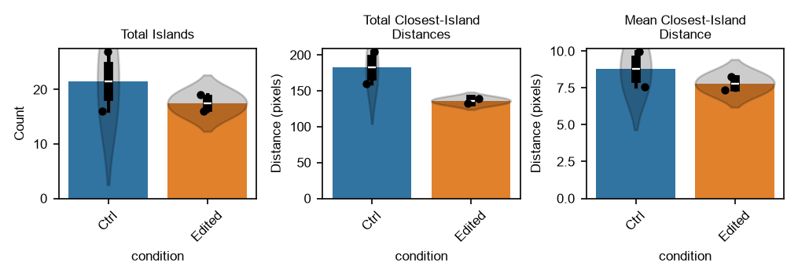

```{python}
lsa.plot_radial_pdfs(df_samples, array_data, OUTPUTDIR)
```
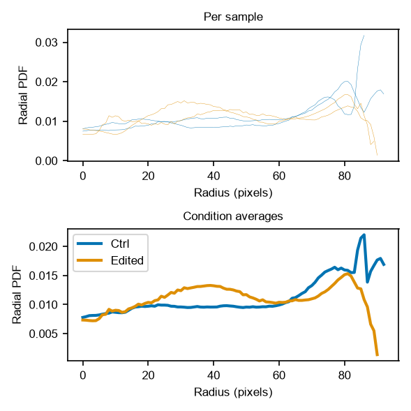

```{python}
lsa.plot_damaged_area(df_samples, OUTPUTDIR)
```
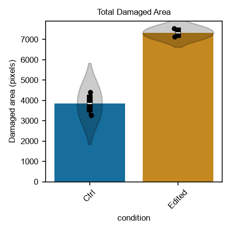

(This plot is exported as `damaged_area_px.png` when no `pixel_to_cm2_factor`
was given, and as `damaged_area_cm2.png` when it was.)

```python
lsa.plot_damaged_percentage(df_samples, OUTPUTDIR)
```

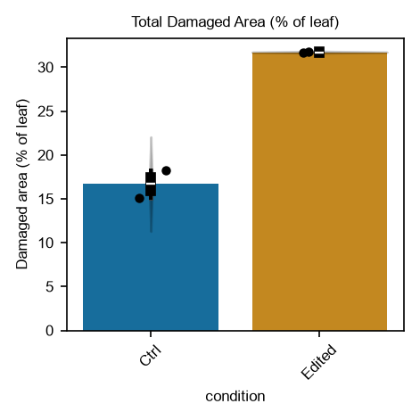

The function `lsa.plot_metric_per_condition` can be used to plot any of the
single-value metrics in `df_samples` per condition; the plot is exported using
the metric name as file name.

The following code plots the threshold that 
was used for something to be considered damaged leaf (`"threshold_val_dmg"`),
this should not show a dependency on the condition (see also above).

```python
lsa.plot_metric_per_condition(df_samples, OUTPUTDIR, metric_key="threshold_val_dmg", 
                              y_label = "Intensity threshold for damage", 
                              title=f"Threshold consistency\nDamage threshold should not\nshow trend per condition.")
```

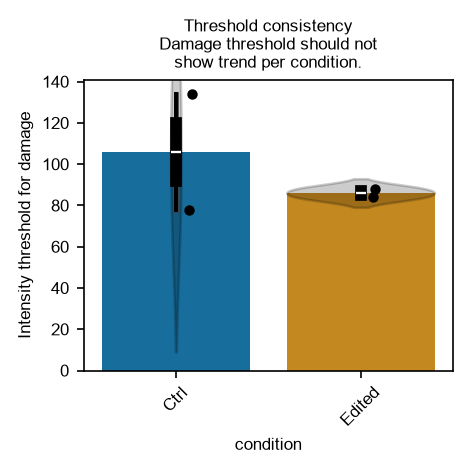

Likewise, the estimated background level of the damage channel 
(`"background_dmg"`) can be plotted, which shouldn't show a trend per condition
either (this is the plot that was also shown above):

```python
lsa.plot_metric_per_condition(df_samples, OUTPUTDIR, metric_key="background_dmg", 
                              y_label = "Estimated background intensity", 
                              title=f"Background consistency\nBackground should not\nshow trend per condition.")
```

Note that currently, the `threshold_val_dmg` is simply twice the `background_dmg`.

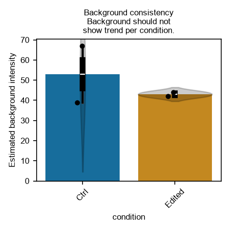

Set `OUTPUTDIR` to a directory where you want the plots to be exported.

To inspect single segmentation and damage area segmentation, run the following function:

```{python}
# 4) Export per-image mask overlays to output folders
lsa.run_plot_and_save(
    df_samples,
    array_data,
    OUTPUTDIR,
    config_channels
)
```


These figures are exported to `OUTPUTDIR/plots/segmentation_masks/<condition>/`,
one per input image, whilst the summary plots are placed directly in
`OUTPUTDIR/plots/`. The segmentation shown here is the first analysis step, on
which all other results depend: the damaged area, the pattern statistics, and
every value in the exported tables are all derived from these masks. It is
therefore recommended to inspect these figures manually for artifacts (e.g. a
mask that captured background instead of the leaf) before interpreting the
summary plots.

#### Exporting data to excel/csv

Finally, the following lines export data to csv and excel files.

```{python}
df_samples.to_csv(OUTPUTDIR + '/data_leaf_damage_singlemetrics.csv', index=False)
df_samples.to_excel(OUTPUTDIR + '/data_leaf_damage_singlemetrics.xlsx', index=False)
```

(All single-value metrics are collected in the `df_samples` dataframe
that `lsa.run_complete_analysis` returns (see above), so they can be written
out directly using the standard pandas export functions. Note that
`.to_excel` requires the `openpyxl` library, see the installation instructions
above.)


## Changelog

See [changelog.md](changelog.md).


# LLM attribution

Parts of this repository were written with the assistance of a large language model
(Claude Opus, Anthropic), used as a coding assistant for code editing and refactoring,
or generating plotting functionalities.

All essential algorithms were designed, reviewed, and validated by the authors.
AI-generated code was inspected and tested before being committed.


