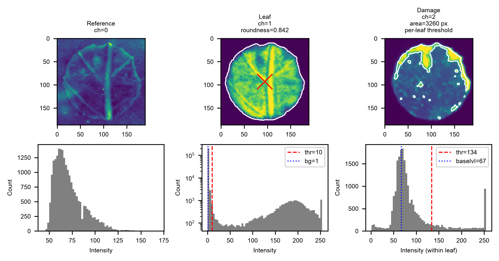
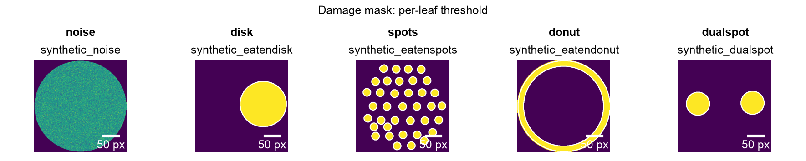
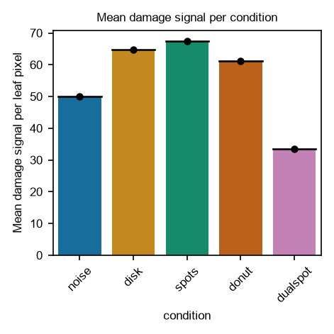
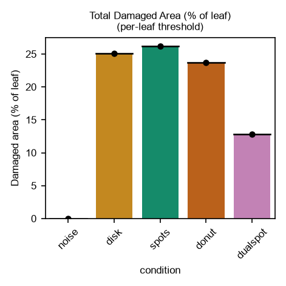
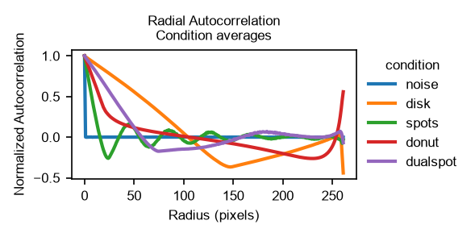
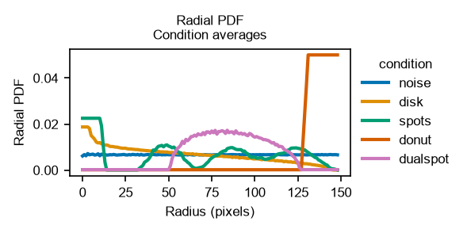
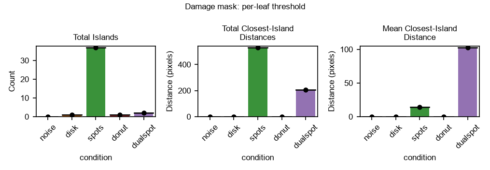

# Quantification of thrip damage patterns to leafs

This project analyzes multi-channel leaf images to quantify thrip feeding damage patterns. The pipeline detects leaf and damage masks, computes spatial metrics (including island counts/distances, radial distributions, autocorrelation, roundness, and total damage area in pixels and optional cm²), and exports both summary tables and diagnostic plots for synthetic and real datasets.

## To install

To find out how to get started with Python and related required software to 
conveniently run scripts, please check out our [blog post](https://www.biodsc.nl/posts/installing_conda_python.html) about this.

Assuming you already have Conda installed, create and activate an environment with the libraries needed to run the scripts in this repository:

```bash
conda create -n leafdamage -c conda-forge python numpy pandas scipy scikit-image matplotlib seaborn imageio openpyxl -y
conda activate leafdamage
```

Run `conda activate leafdamage` again whenever you open a new terminal to work with this code.

## To run (example scripts)

To run this script, check out the files:
- [leafstats_example_1channel.py](leafstats_example_1channel.py), which shows how to analyze a dataset where 1 channel was recorded to identify both the leaf and the damage done by thrips. (In the example, the same channel of the example images is simply assigned to both roles, for illustratory purposes.)
- [leafstats_example_3channels.py](leafstats_example_3channels.py), which shows how to analyze a dataset where 3 channels were taken, 1 for identifying the leaf, 1 for quantifying the damage, and 1 that is only displayed for reference.
- [leafstats_syntheticdata.py](leafstats_syntheticdata.py), which runs the  analysis pipeline on the synthetic images in [Synthetic_data/](Synthetic_data/); it generates the synthetic-data figures shown below.

The first two examples run out of the box on the images in [Example_data/](Example_data/).
All three scripts refer to those images with paths relative to the root of this repository,
so **run them with the repository root as your working directory**. 
Paths may also be given as absolute paths, which is convenient when your own 
data is located elsewhere.

*For reference: an [older description](readme_old.md) of how the scripts work. 
For a current description, see the example scripts above, and explanation
of the plots below.* 

## Expected input

A `.tif` image files where 

- 1 channel recorded intensity of the leaf itself (to be able to segment the leaf)
- 1 channel recorded the thrip activity pattern (using near infrared, NIR, sometimes colloqually referred to as "damage" in this repo)

Ideally, these channels are separate to avoid artifacts and detect
leaves properly, but the damage channel can also be used
to segment the leaf, in which case a single-channel image can be provided as 
input aswell.

<br>
***Example input image.** The green channel corresponds to the leaf intensity, 
and the blue channel to the thrip activity (NIR). The red channel does not 
enter any of the metrics; it can be assigned as the "reference" channel, in 
which case it is only displayed alongside the other two.*

| Red channel | Green channel | Blue Channel |
| ------- | ------- | ------- |
|  |  |  |

***Example input image.** Same as above, but the R, G, B channels
are displayed separately here in gray scale.
The green channel corresponds to the leaf intensity, 
and the blue channel to the thrip activity (NIR). 
The red channel does not enter any of the metrics, and is only displayed 
when it is assigned as the "reference" channel.*

## The analysis pipeline script 


All functions that are used in this pipeline are defined in [leafstats_analysis.py](leafstats_analysis.py). The idea is that you run the pipeline using a second script
from which you import this main pipeline script as follows:

```{python}
import leafstats_analysis as lsa
```

When you run this line, you can call functions from [leafstats_analysis.py](leafstats_analysis.py) using `lsa.<function name>()`, e.g.
`lsa.run_complete_analysis()`.
This is shown in the [example scripts](#to-run-example-scripts).

## How the pipeline works

This script:
- segments the leaves in a straighforward way
- segments and quantifies leaf damage in a straightforward way
- tries to quantify potential feeding patterns

### Segmentation of leaves

Segmentation of the leaf is based on standard threshold algorithms.

Segmentation is performed by the function `lsa.get_largest_mask()`, which is 
called automatically by the function `lsa.run_complete_analysis()`.

This function determines a threshold based on either:

- 10x the background level (`leaf_threshold_method='bg10'`)
- Otsu method (`leaf_threshold_method='otsu'`)
- Triangle method (`leaf_threshold_method='triangle'`)

When a seperate channel was used to record the leaf, the default `bg10` method
works well. 
When a single channel was used to record both damage and the leaf outline
in one go, the `triangle` method is more suitable.

#### More details

To prevent background artifacts to be taken along, the largest consecutive
area that is above the threshold is selected and assumed to be the leaf.

Additional tuning parameters are:

- `leaf_roundness_threshold`, default: 0
    - Roundness is defined as $R = 4 \pi A / C^2$. With A the area, and C
    the circumference. For a perfect circle, $4 \pi A = C^2$, and $R =1$. The 
    lower the value, the least an object looks like a circle.
    - This can be used to disregard suggested leaf segmentation masks
    that are not round (and thus likely not proper masks). A cutoff of e.g. 
    0.8 will select leaves that are approximately round.
- `apply_smooth_leafmask`, default: False
    - Will apply morphological operation (opening, with a disk of radius 
    10 pixels) to make the edge of the mask more smooth.
    
### Determining the damaged area

Which area is considered "damaged" in the end depends on the selected
threshold.

The choice of threshold will affect all further statistics that try
to describe the damage pattern.

This threshold is determined automatically. For many threshold algorithms,
the threshold level will depend both on the pattern of low signal (undamaged)
as well as the pattern of high signal (damaged), and inbetween values.

This needs to be avoided, as we don't want the amount of true damage influencing
the detection of the damaged region and the detected damage pattern.

#### Base level and threshold

**Above twice base level is damage.** The algorithm chosen here attempts 
to set a threshold value independent of the amount of damage present. 

It focuses on determining the base level NIR intensity in undamaged leaf parts.
The base level is estimated by setting it to the mode of the damage channel
(within the leaf mask). 
Everything within the leaf mask with an intensity higher than 2x a 
"base level" is considered "damaged". 

There are two base levels and corresponding damage thresholds determined:
- **Per-leaf base level and threshold.** Per-leaf base levels are calculated using the mode.
    - Damage threshold based on these base levels are identified with the keyword `_leafthr`.
- **Reference-condition threshold.** The median per-leaf base level in a reference condition (e.g. a control sample) is used to determine.
    - Damage threshold based on these base levels are identified with the keyword `_refthr`.

Assumptions here are:

- For both methods (i) and (ii):
    - **Critical assumption (1):** A substantial part of the leaves from which the base level is determined show base level damage. 
- For method (i):
    - **Critical assumption (2):** To compare between conditions with method (i), 
    the base level leaf damage should be invariant across conditions. Otherwise,
    the damaged area indicates per-leaf high damage ares.
- For method (ii):
    - **Critical assumption (3):** All images are taken under equal illumination and 
    acquisition conditions.


**^ Example figure [baselvl_dmg.pdf](Example_data/OUTPUT-3channels_frozen/plots_general_stats/baselvl_dmg.png)** showing that the base level can show a trend
per condition.

#### Resulting leaf and damage masks

The image below shows the result of both segmentation of the leaf
and determining the damaged area (for method (i); the corresponding images for 
method (ii) are exported as well, see "Output folders" below):

<!-- img "Example_data/DATA/condition_Control/Example_A_1.tif" -->



***Figure.** White lines indicate the outline of the segmented areas. Histograms of 
pixel intensities are shown below the images. The blue line indicates
the estimated background intensity for "leaf", and the estimated base level
(within the leaf) for "damage"; the red line indicates the threshold that was 
used for the mask.*

#### Potential & necessary improvements

- The distribution of undamaged leaf intensity could be estimated in more
sophisticated ways (e.g. fitting a gaussian to part of the histogram),
allowing for a better estimate on what the expected range of 
undamaged signal is, and thus what can be considered damaged area.

## How the damage pattern is quantified

To assess the nature of the damage patterns, multiple metrics are calculated.

To understand these metrics, they were first calculated for a synthetic dataset.
This dataset contained the following "leafs" with corresponding "damage patterns":



[overview_damage.pdf](Synthetic_data/OUTPUT_frozen/plots_damageregionstats_leafthr/overview_damage.pdf). The "Noise pattern" contains a uniform "damage" signal with noise.
The other signals are chosen to be "extreme" representations of 
different patterns that might be in the data; one big damage spot, a load
of small spots, only around the edges, two bigger spots.

### Metrics

#### Amount of damage

 &nbsp; 

**(left)** [mean_dmg_signal.pdf](Synthetic_data/OUTPUT_frozen/plots_general_stats/mean_dmg_signal.pdf) 
Shows the mean damage (NIR) signal per leaf pixel, ie the average intensity of 
the damage channel within the leaf mask. 
**(right)** [damaged_percentage.pdf](Synthetic_data/OUTPUT_frozen/plots_damageregionstats_leafthr/damaged_percentage.pdf) 
Lists the percentage area covered by the damage. (This was chosen to be ±equal, except for "dual spot".)


This mean damage metric does not depend on the threshold used to determine the damaged
area, but it does include all signal within the leaf, also signal 
that is not considered damage. The "noise" leaf illustrates this: no damaged 
area is detected, but its uniform signal still gives a mean signal comparable
to the other leaves.

#### Autocorrelation function (ACF)

Average correlation between the damage signal in two pixels that are a distance X apart.

Concretely, if the correlation is positive at distance X, 
it means that the intensity for any two pixels with distance X is likely
to be more similar.
If the correlation is negative at distance X, it's likely the signal
for two pixels at distance X is opposite between the two pixels.


<br>

[Radial_acf_averages.pdf](Synthetic_data/OUTPUT_frozen/plots_general_stats/Radial_acf_averages.pdf). The different signals clearly pick up the different patterns;

- The "disk" pattern is positive for the longest distance (biggest structure).
- The "spots" signal shows multiple small peaks because spots are small and have a regular structure.
- The "donut" shows a sharp peak (small width), and a peak at high distance
due to the two sides of the "donut" on each end of the leaf being correlated.
- The "dualspot" is similar to "spots", but much wider and containing only 
two peaks.

Note furthermore that the 
distance at which the curve first crosses zero reflects the size of the 
damaged features, whereas a secondary peak reflects a typical spacing between 
them. 

##### Technical points

**Technical note 1:** Note that the curve is normalized by the variance over the whole leaf, so 
such a secondary peak can exceed 1 (see "dual spot").

**Technical note 2:** We define the ACF for a displacement vector $`\vec{X}`$ as

```math
\mathrm{ACF}(\vec{X}) = \frac{1}{\sigma^2\, n(\vec{X})}
    \sum_{\vec{x} \in M,\ \vec{x}+\vec{X} \in M}
    \left(I(\vec{x})-\mu\right)\left(I(\vec{x}+\vec{X})-\mu\right)
```

with $`I`$ the damage channel, $`M`$ the leaf mask holding $`N`$ pixels,
$`\mu`$ and $`\sigma^2`$ the mean and variance of $`I`$ within $`M`$, and
$`n(\vec{X})`$ the number of pixel pairs separated by $`\vec{X}`$ that have
both pixels inside $`M`$. Dividing by $`n(\vec{X})`$ normalizes by the 
number of pairs considered.
Displacements with too few contributing pairs ($`n(\vec{X}) < fN`$, with
$`f=0.05`$ as default value) are considered unreliable and discarded.
$`\mathrm{ACF}(d)`$ is then the average of $`\mathrm{ACF}(\vec{X})`$ over all
retained $`\vec{X}`$ of length $`\lfloor|\vec{X}|\rfloor = d`$.
See also [notes/ACF.md](notes/ACF.md).


#### Radial distribution

Whereas the ACF quantifies *relative* spatial patterns, the radial distribution
quantifies the pattern of damage with respect to the location *on the leaf*.

It is the average signal from the center of the leaf at distance X.

The aim of this function is to characterize whether the location on the leaf
(in terms of distance from the center) affects the likelyhood of damage.


<br>

[radial_pdfs_averages.pdf](Synthetic_data/OUTPUT_frozen/plots_general_stats/radial_pdfs_averages.pdf). We can again recognize the patterns, e.g. the "donut" 
only has a signal at a high radius, whereas the "disk" is represented at 
any radius.

#### Island statistics



[nearest_island_distances.pdf](Synthetic_data/OUTPUT_frozen/plots_damageregionstats_leafthr/nearest_island_distances.pdf) This plot quantifes the number of separate 
continuous regions of damage (the number of connected components),
also referred to as *islands*, that are observed in the damage mask.
Both the island count as well as metrics regarding the distance inbetween
are quantified.

The total closest-island distance "draws lines" between each island and it's
closest neighbor, and sums those lines. The idea is that this quantifies
the amount of distance thrips travel from one to the next feeding island.

The average clostest-island distance takes the average of those lines.

Thus, colloqually, the *total* distance quantifies the total amount of 
"walking without eating" on a leaf,
whilst the average quantifies the amount of "walking without eating" thrips are willing to to 
*between one island to the next*.

**Technical: sum of distances.** The sum of nearest-island distances $D$,
mathematically, is defined as


```math
D = \sum_{n} \min_{m \neq n} d_{nm}
```

which is the sum over the smallest edge-to-edge distance $d$ between island n and all other
islands m (with $m \neq n$ excluding self-distance).

**Technical: average  of distances.** Additionally, we look at the average nearest-island distance, $`\bar{D} = D / N`$, 
with $`N`$ the number of islands. 

Note that when fewer than two islands are detected, there is no distance to
another island; both $`D`$ and $`\bar{D}`$ are reported as 0 in that case.


#### Output folders

The value of metrics that depend on the damage mask (damage threshold, damaged area & 
percentage, island statistics, status fields) 
depends on whether the damage mask was determined by method (i) 
or method (ii).
The output data indicates this using their identifiers,
`_leafthr` and `_refthr`, respectively.
Plots that depend on the damage mask are written to folders per method, 
plots that do not are written to a general directory.
Segmentation masks for the two damage mask methods 
are plotted for reference to two separate folders,
and a summary table can be found in the root folder.

This results in the following output folder structure:

```
OUTPUTDIR/
  plots_general_stats/                 plots that don't depend on the damage mask 
                                       (ACF, radial distribution, base level, mean damage signal)
  plots_damageregionstats_leafthr/     damaged area & percentage, island statistics, 
  plots_damageregionstats_refthr/      damage threshold, damage overview
  plots_segmasks_leafthr/<condition>/  per-image segmentation plots
  plots_segmasks_refthr/<condition>/
  data_leaf_damage_singlemetrics.csv   single-value metrics (both methods)
  data_leaf_damage_singlemetrics.xlsx
```

## Changelog

The file [notes/readme.md](notes/readme.md) serves for taking notes, and 
doubles as changelog.


# LLM attribution

Parts of this repository were written with the assistance of a large language model
(Claude Opus, Anthropic), used as a coding assistant for code editing and refactoring,
or generating plotting functionalities.

All essential algorithms were designed, reviewed, and validated by the authors.
AI-generated code was inspected and tested before being committed.


