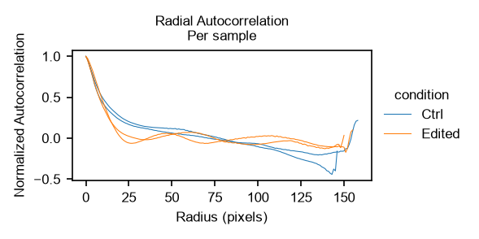
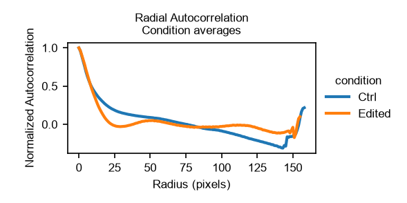
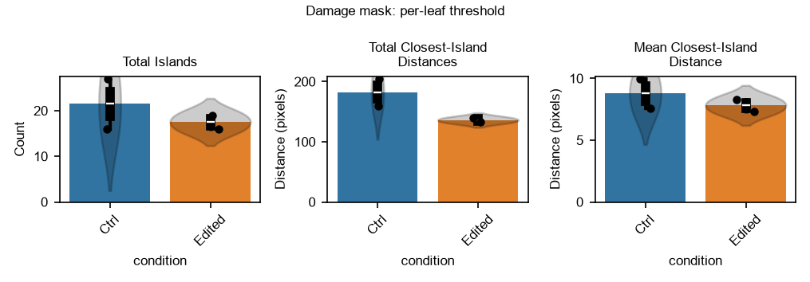
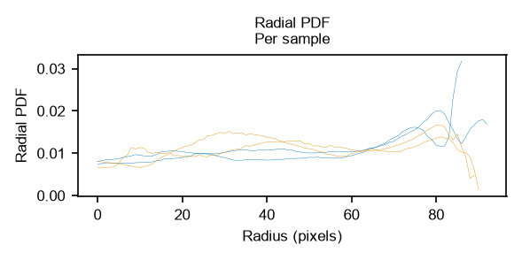
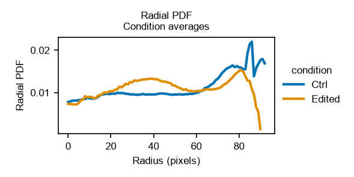
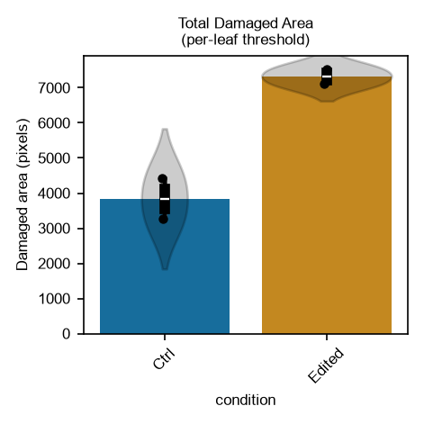
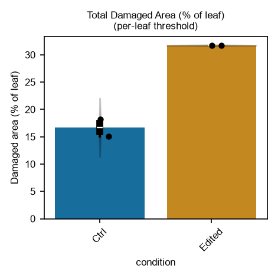
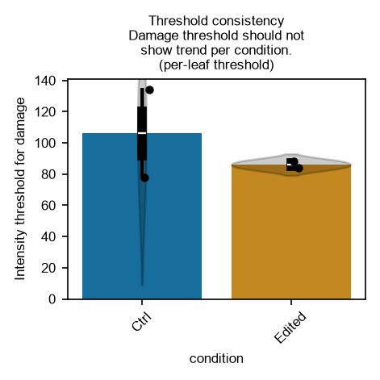
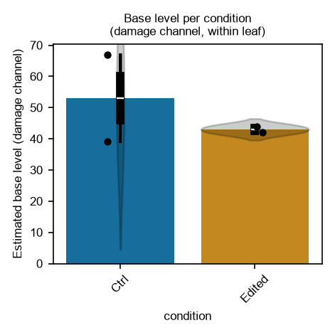
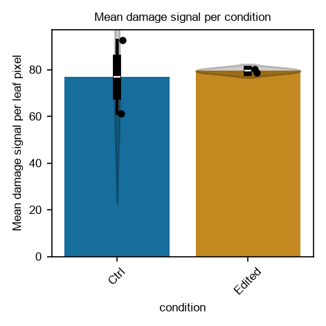

#### Generating plots

To generate each of the plots, the following functions can be used.
Functions that plot damage-mask dependent data (`plot_nearest_island_distances`, 
`plot_damaged_area`, `plot_damaged_percentage`, `plot_damage_overview`, 
`run_plot_and_save`, and `plot_metric_per_condition` for damage-mask 
dependent metrics such as `"threshold_val_dmg"`) take the argument 
`damage_mask_method='leafthr'` (default) or `damage_mask_method='refthr'`, which selects 
the method, and save their output to `OUTPUTDIR/plots_damageregionstats_<leafthr|refthr>/`
(or `OUTPUTDIR/plots_segmasks_<leafthr|refthr>/` for `run_plot_and_save`). 
Other plots are saved to `OUTPUTDIR/plots_general_stats/`. For brevity, the 
examples below show the default; in the example scripts, these plots are made
for both methods. (The damage-mask dependent figures shown below are those 
of the per-leaf threshold method, `damage_mask_method='leafthr'`.)

```{python}
lsa.plot_acf_norms_avgrs(df_samples, array_data, OUTPUTDIR)
```

<br>


```{python}
lsa.plot_nearest_island_distances(df_samples, OUTPUTDIR, remove_zerocnt=False)
lsa.plot_nearest_island_distances(df_samples, OUTPUTDIR, remove_zerocnt=True)
```



```{python}
lsa.plot_radial_pdfs(df_samples, array_data, OUTPUTDIR)
```
<br>


```{python}
lsa.plot_damaged_area(df_samples, OUTPUTDIR)
```


(This plot is exported as `damaged_area_px.png` when no `pixel_to_cm2_factor`
was given, and as `damaged_area_cm2.png` when it was.)

```python
lsa.plot_damaged_percentage(df_samples, OUTPUTDIR)
```



The function `lsa.plot_metric_per_condition` can be used to plot any of the
single-value metrics in `df_samples` per condition; the plot is exported using
the metric name as file name.

The following code plots the threshold that 
was used for something to be considered damaged leaf (`"threshold_val_dmg"`),
this should not show a dependency on the condition (see also above).

```python
lsa.plot_metric_per_condition(df_samples, OUTPUTDIR, metric_key="threshold_val_dmg", 
                              y_label = "Intensity threshold for damage", 
                              title=f"Threshold consistency\nDamage threshold should not\nshow trend per condition.")
```



Likewise, the estimated base level of the damage channel within the leaf
(`"baselvl_dmg"`) can be plotted, which ideally shouldn't show a trend per 
condition either (this is the plot that was also shown above):

```python
lsa.plot_metric_per_condition(df_samples, OUTPUTDIR, metric_key="baselvl_dmg", 
                              y_label = "Estimated base level (damage channel)", 
                              title="Base level per condition\n(damage channel, within leaf)")
```

Note that currently, the `threshold_val_dmg` is simply twice the `baselvl_dmg`.



The mean damage signal per leaf pixel (`"mean_dmg_signal"`, ie the mean 
intensity of the damage channel within the leaf mask) can be plotted in the
same way. In contrast to the damaged area, this metric does not depend on 
the damage threshold, and is therefore not affected by changes in the base 
level (see assumptions above). 

```python
lsa.plot_metric_per_condition(df_samples, OUTPUTDIR, metric_key="mean_dmg_signal", 
                              y_label = "Mean damage signal per leaf pixel", 
                              title="Mean damage signal per condition")
```



Set `OUTPUTDIR` to a directory where you want the plots to be exported.

To inspect single segmentation and damage area segmentation, run the following function:

```{python}
# 4) Export per-image mask overlays to output folders
lsa.run_plot_and_save(
    df_samples,
    array_data,
    OUTPUTDIR,
    config_channels
)
```


These figures are exported to 
`OUTPUTDIR/plots_segmasks_<leafthr|refthr>/<condition>/`,
one per input image, whilst the summary plots are placed in the other 
`plots_*` folders (see the output structure above). The segmentation shown here is the first analysis step, on
which all other results depend: the damaged area, the pattern statistics, and
every value in the exported tables are all derived from these masks. It is
therefore recommended to inspect these figures manually for artifacts (e.g. a
mask that captured background instead of the leaf) before interpreting the
summary plots.

#### Exporting data to excel/csv

Finally, the following lines export data to csv and excel files.

```{python}
df_samples.to_csv(OUTPUTDIR + '/data_leaf_damage_singlemetrics.csv', index=False)
df_samples.to_excel(OUTPUTDIR + '/data_leaf_damage_singlemetrics.xlsx', index=False)
```

(All single-value metrics, for both damage threshold methods, are collected 
in the `df_samples` dataframe (see above), so they can be written
out directly using the standard pandas export functions. Note that
`.to_excel` requires the `openpyxl` library, see the installation instructions
above.)